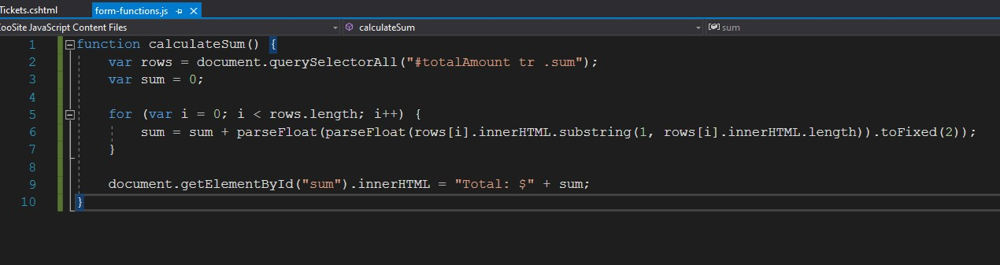

# Module 8: Using Layouts, CSS and JavaScript in ASP.NET Core MVC

## Lab: Using Layouts, CSS and JavaScript in ASP.NET Core MVC

1. **Nombres y apellidos:** Francisco Javier Moreno Quevedo
2. **Fecha:** 02/12/2020
3. **Resumen del Ejercicio:** Añadir los componentes necesarios para hacer funcional la aplicacion de venta de un Zoo 3/4
4. **Dificultad o problemas presentados y como se resolvieron:** Ninguna

- Ejercicio 3: Using JavaScript
  - Añadimos la carpeta js y creamos un fichero javascript **form-functions.js**
  
  - En la vista  **BuyTickets.cshtml** enlazamos este fichero
  
  - Escribimos el codigo javascript que calculara la suma de los importes de los tickets comprados
  
    

